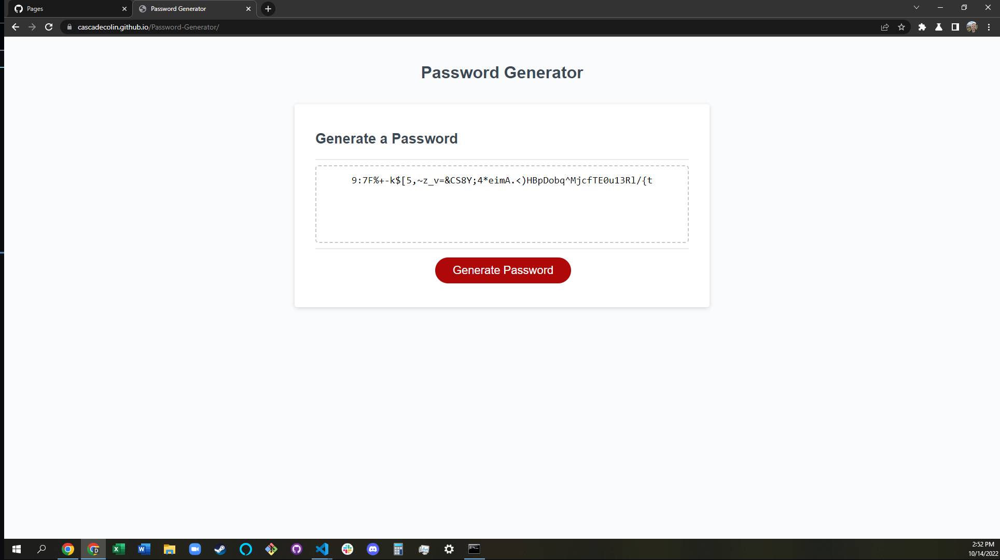

# 03 JavaScript: Password Generator

## Overview

### The goal of this project

- Create a web application that randomly generates a secure password
- Allow the user to specify if they would prefer to use certain character types
- Allow the user to specify a length between 8 and 128 characters

## Table of Contents

- [Description](#Description)
- [Technology](#Technology)
- [License](#license)
- [Badges](#badges)

## Description

The deployed web application can be found at: https://cascadecolin.github.io/Password-Generator/

The purpose of this application is to provide users with a secure, randomly generated password. Users are allowed to specify if they would prefer to use lower case letter, upper case letters, numbers, and symbols. Additionally, users are also prompted to specify a password length of 8 to 128 characters. Less than 8 characters is not allowed as that would not be a secure password. Additionally, most modern websites do not allow users to have passwords fewer than 8 characters. There is also a 128 character limit because most websites do not allow users to exceed that amount, primarily because it is a waste of computational resources.

Upon selecting at least 1 set of characters and inputting a valid password length, the user is presented with a password that can be easily copy and pasted. Using a secure and unique password is critical for account safety and this application will help make that safety easier for people to access.

Below: A preview of the deployed page with a password already generated.

## Technology

Microsoft's VS Code was the programming platform. GitBash was used for version control for the repository. A GitHub repository was utilized for version control, as well as provide a streamlined deployment to GitHub Pages. Testing for bugs and functionality was performed using Chrome DevTools.

## License

MIT License

Copyright (c) 2022 CascadeColin

Permission is hereby granted, free of charge, to any person obtaining a copy
of this software and associated documentation files (the "Software"), to deal in the Software without restriction, including without limitation the rights to use, copy, modify, merge, publish, distribute, sublicense, and/or sell copies of the Software, and to permit persons to whom the Software is furnished to do so, subject to the following conditions:

The above copyright notice and this permission notice shall be included in all copies or substantial portions of the Software.

THE SOFTWARE IS PROVIDED "AS IS", WITHOUT WARRANTY OF ANY KIND, EXPRESS OR IMPLIED, INCLUDING BUT NOT LIMITED TO THE WARRANTIES OF MERCHANTABILITY, FITNESS FOR A PARTICULAR PURPOSE AND NONINFRINGEMENT. IN NO EVENT SHALL THE AUTHORS OR COPYRIGHT HOLDERS BE LIABLE FOR ANY CLAIM, DAMAGES OR OTHER LIABILITY, WHETHER IN AN ACTION OF CONTRACT, TORT OR OTHERWISE, ARISING FROM, OUT OF OR IN CONNECTION WITH THE SOFTWARE OR THE USE OR OTHER DEALINGS IN THE SOFTWARE.

## Badges

